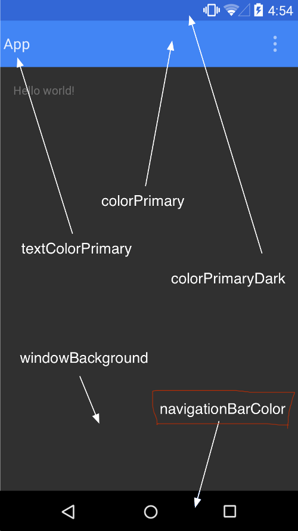

# beginers

Following can be found in the project
-------------------------------------

# ViewBinding 
to achieve we are to add following in the gradle file
buildFeatures {
viewBinding = true
}
It helps to get rid of findViewById which makes it null safe.
For more info can refer:
https://developer.android.com/topic/libraries/view-binding

# Retrofit
to make END Point call using Retrofit libs.

# CardView
 added for design

# Co-ordinate layout
added for design

# Glide
to load image from an URL

# gradient
being used to set as homepage bg

# LocalBroadCast
to update the changes being made in the edit screen in all the previous screens i.e List and Details

# Update color of title bar and Bottom Navbar
acieved by adding following in the theme
<item name="colorSecondary">@color/user_item_bg</item>
<item name="android:navigationBarColor">@color/user_item_bg</item>

# Circular Image Viee for profile Image
achieved by libs added in gradle

# RecyclerView with custom adapter

# FloatingActionButton
used as edit icon in details screen

# Serializable
all the data class has been implemented since we are to traverse object from one screen to other

# ssp and sdp dimen 
added via lib to support different screen sizes with one single layout

# to create kotlin data class from amy jason
add a plugin "Kotlin data class file from Json"
Sample json to start the project
{"results":[{"gender":"female","name":{"title":"Mrs","first":"Purificación","last":"Gómez"},"location":{"street":{"number":5816,"name":"Calle del Pez"},"city":"San Sebastián de Los Reyes","state":"Comunidad Valenciana","country":"Spain","postcode":65895,"coordinates":{"latitude":"-32.6008","longitude":"169.7408"},"timezone":{"offset":"+4:00","description":"Abu Dhabi, Muscat, Baku, Tbilisi"}},"email":"purificacion.gomez@example.com","login":{"uuid":"c57a9cc9-9501-4bdc-bd79-dd1092b473db","username":"purplesnake831","password":"jeanne","salt":"vbgTZWE2","md5":"6c6d5b35032bc9d3ac6c45ff40be412f","sha1":"6d7b52afb758863d37933988acf1eb82f8e9f281","sha256":"ebe2eac2feffcdab08b6578a2bb7296cc165fa1978b2df10d1b0f6a8ddea5e6e"},"dob":{"date":"1949-10-11T21:55:55.410Z","age":74},"registered":{"date":"2003-04-27T20:15:16.319Z","age":20},"phone":"917-342-873","cell":"614-372-219","id":{"name":"DNI","value":"17858741-Z"},"picture":{"large":"https://randomuser.me/api/portraits/women/56.jpg","medium":"https://randomuser.me/api/portraits/med/women/56.jpg","thumbnail":"https://randomuser.me/api/portraits/thumb/women/56.jpg"},"nat":"ES"}],"info":{"seed":"50e9c0d5662c0ad2","results":1,"page":1,"version":"1.4"}}

